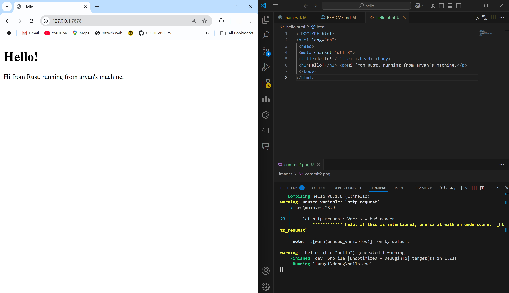
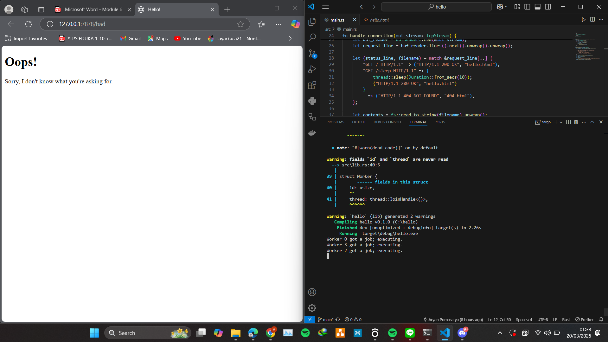
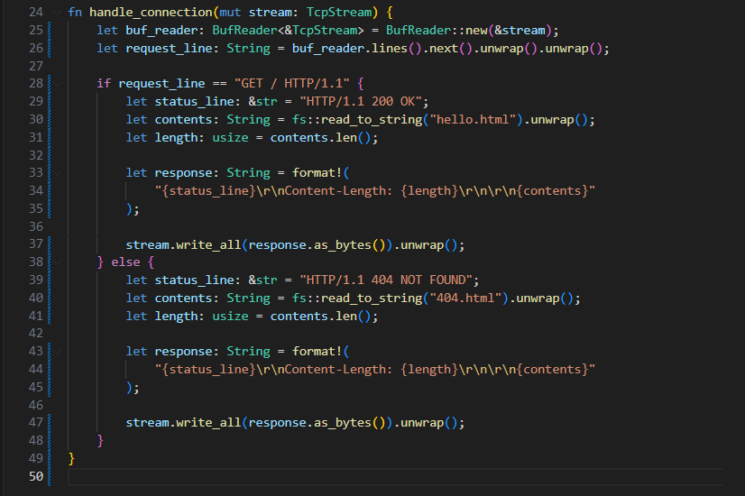
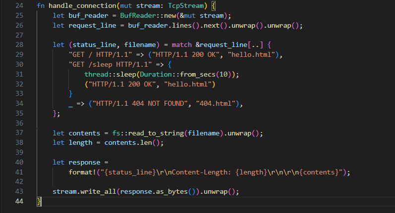

# Refleksi Commit 1

Kode ini membuat sebuah *TCP listener* pada alamat 127.0.0.1:7878, dan setiap koneksi yang masuk akan diteruskan ke fungsi `handle_connection`. Di dalam `handle_connection`, objek `TcpStream` dibungkus dengan `BufReader`, yang digunakan untuk membaca baris demi baris hingga menemukan baris kosong yang menandakan akhir dari *header* permintaan. Baris-baris header tersebut kemudian dikumpulkan ke dalam sebuah *vector* dan ditampilkan di konsol, memperlihatkan detail permintaan HTTP yang biasa. Karena tidak ada respons yang dikirimkan kembali, peramban atau perangkat lunak lain yang membuka koneksi akan terus menunggu hingga koneksi mengalami *timeout*.

# Refleksi Commit 2

Setelah dimodifikasi, fungsi `handle_connection` kini mengembalikan respons berupa HTML. Konten HTML tersebut dibaca dari file *hello.html* menggunakan `fs::read_to_string` dan disimpan dalam variabel `contents` sebagai sebuah *String*. Selain itu, *response body* juga dilengkapi dengan status line dan header `Content-Length`, yang penting untuk menunjukkan apakah koneksi berhasil atau gagal, serta memastikan panjang respons yang dikirim. Terakhir, `format!` digunakan untuk menggabungkan status line, `Content-Length`, dan isi HTML menjadi satu string utuh, yang kemudian dikirim melalui koneksi TCP menggunakan `stream.write_all()`.

Fungsi handle_connection berfungsi untuk memeriksa permintaan dari klien. Bila permintaan tersebut mengarah ke jalur utama, maka server akan memberikan respons berupa konten dari hello.html. Jika tidak, maka server akan menampilkan halaman kesalahan dari 404.html.

### Sebelum Refactoring

### Sesudah Refactoring

# Refleksi Commit 4  
Pada kode yang telah diperbarui, ditambahkan rute baru (`GET /sleep HTTP/1.1`) yang akan menunda pengiriman respons selama 10 detik. Artinya, ketika browser mengakses rute `/sleep`, halaman akan memuat lebih lama karena thread akan "tidur" selama 10 detik. Karena server menangani permintaan secara sinkron, rute yang lambat ini bisa menyebabkan permintaan lain ikut tertunda jika ada banyak pengguna yang terhubung secara bersamaan. Perilaku ini menunjukkan pentingnya mempertimbangkan penggunaan *concurrency* atau pemrosesan asinkron dalam lingkungan produksi.

# Refleksi Commit 5  
*Thread pool* adalah kumpulan thread yang sudah dibuat sebelumnya dan siap digunakan untuk menangani tugas secara bersamaan. Saat ada tugas baru, salah satu thread akan menjalankannya, sementara thread lainnya tetap tersedia untuk tugas-tugas berikutnya. Setelah selesai, thread akan kembali ke *pool* untuk dipakai lagi di masa mendatang.

Dalam commit ini, *thread pool* diimplementasikan melalui sebuah struct `ThreadPool` yang mengelola sejumlah instance `Worker` serta tipe `Job` yang merepresentasikan tugas-tugas yang akan dikerjakan. Komunikasi antar komponen dilakukan melalui *message passing*, dengan `ThreadPool` bertindak sebagai pengirim dan setiap `Worker` sebagai penerima tugas.

Struktur `ThreadPool` menyimpan sejumlah thread pekerja tetap dan sebuah *sender* untuk mengirim tugas melalui kanal `mpsc`. Setiap `Worker` direpresentasikan oleh struct `Worker` yang menjalankan thread yang terus-menerus menunggu dan mengeksekusi tugas dari *receiver* bersama yang dilindungi oleh `Mutex`. Tugas yang dijalankan didefinisikan sebagai *boxed closure* yang mengimplementasikan `FnOnce() + Send + 'static`, sehingga aman untuk dijalankan dalam sebuah thread. Fungsi `main` menggunakan metode `execute` untuk mengatur tugas seperti menangani koneksi TCP. Dengan desain ini, server dapat memproses banyak permintaan secara bersamaan, sehingga tugas yang lambat tidak menghambat seluruh server.

# Refleksi Commit Bonus  
Saya menambahkan fungsi `build()` pada implementasi `ThreadPool` sebagai alternatif dari konstruktor `new()`. Perubahan ini dilakukan untuk mengeksplorasi variasi penamaan dan memahami lebih dalam mengenai desain API di Rust. Secara fungsional, `build()` melakukan hal yang sama dengan `new()`—membuat kanal, membungkusnya dengan `Mutex` dan `Arc`, serta menginisialisasi thread-thread pekerja.

Penggunaan nama seperti `build()` bisa lebih bermanfaat ketika proses pembuatan objek menjadi lebih kompleks di masa mendatang atau berkembang menjadi pola *builder*, yang umum digunakan dalam banyak pustaka dan *framework* Rust. Meskipun saat ini `build()` dan `new()` menghasilkan hal yang sama, `build()` bisa lebih ekspresif dan menyampaikan bahwa pembuatan objek tersebut memungkinkan adanya konfigurasi yang lebih detail, sementara `new()` lebih cocok digunakan untuk proses pembuatan objek yang sederhana.

